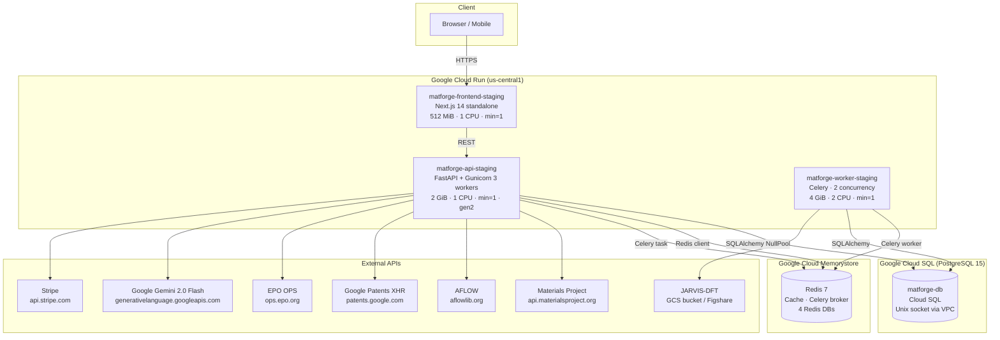
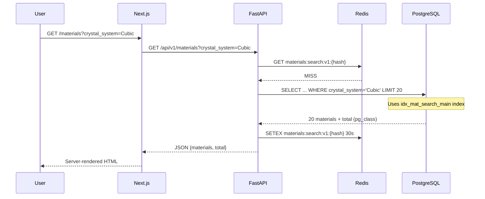
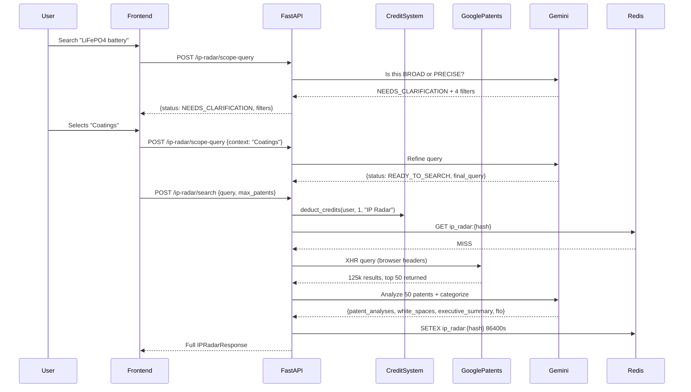
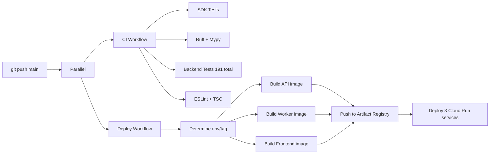

# MatCraft — System Architecture

> **Stack**: Next.js 14 · FastAPI · PostgreSQL · Redis · Celery · Google Cloud Run · Stripe · Gemini 2.0

---

## System Diagram



---

## Technology Stack

| Layer | Technology | Version | Purpose |
|-------|-----------|---------|---------|
| **Frontend** | Next.js | 14.2.30 | SSR/SSG, App Router |
| | React | 18 | UI library |
| | TypeScript | 5 | Type safety |
| | Tailwind CSS | 3 | Styling |
| | Framer Motion | 10 | Animations |
| | React Three Fiber | 8 | 3D WebGL rendering |
| | Three.js | 0.162 | 3D engine |
| | Recharts | 2 | Charts (band structure, DOS, etc.) |
| | @tanstack/react-query | 5 | Client-side data fetching |
| | next-auth | 4 | Authentication (Google OAuth, credentials) |
| **Backend** | Python | 3.12 | Runtime |
| | FastAPI | 0.104 | API framework |
| | Uvicorn | 0.24 | ASGI server |
| | Gunicorn | 21.2 | Process manager (3 workers) |
| | SQLAlchemy | 2.0 | ORM |
| | Pydantic | 2.5 | Validation |
| | Celery | 5.3 | Async task queue |
| | httpx | 0.25 | Async HTTP client |
| | stripe | 11 | Payment processing |
| | google-generativeai | 0.8 | Gemini AI |
| | mp-api | 0.41 | Materials Project client |
| | pymatgen | 2024.2.8 | Crystal structure tools |
| **Database** | PostgreSQL | 15 | Primary data store (Cloud SQL) |
| | Redis | 7 | Cache + Celery broker (Memorystore) |
| **Infrastructure** | Google Cloud Run | gen2 | Serverless containers |
| | Google Cloud SQL | — | Managed PostgreSQL |
| | Google Memorystore | — | Managed Redis |
| | Google Artifact Registry | — | Docker image storage |
| | Google Secret Manager | — | Secrets (18 secrets) |
| | Google Cloud Storage | — | JARVIS dataset (~76k materials) |
| **CI/CD** | GitHub Actions | — | Build + deploy pipeline |
| **Payments** | Stripe | — | Credits + subscriptions |
| **AI** | Google Gemini 2.0 Flash | — | Patent analysis, query scoping |

---

## Cloud Run Services

| Service | Memory | CPU | Min Inst | Max Inst | Timeout | Concurrency |
|---------|--------|-----|----------|----------|---------|-------------|
| `matforge-frontend-staging` | 512 MiB | 1 | 1 | 5 | 300s | 80 |
| `matforge-api-staging` | 2 GiB | 1 | 1 | 10 | 600s | 80 |
| `matforge-worker-staging` | 4 GiB | 2 | 1 | 5 | 3600s | — |

All services use `--execution-environment gen2` and `--cpu-boost` for faster cold starts.

---

## Request Lifecycle — Material Search



---

## Request Lifecycle — IP Radar Search (Authenticated)



---

## Middleware Stack (FastAPI, in execution order)

```
CORS → RequestID → GZip (min 1000B) → RateLimiting → RequestLogging → SecurityHeaders → Routes
```

| Middleware | Purpose |
|-----------|---------|
| CORSMiddleware | Allow `https://matcraft.ai` + frontend URLs |
| RequestIDMiddleware | Generate X-Request-ID for every request |
| GZipMiddleware | Compress responses > 1000 bytes |
| RateLimitingMiddleware | 120 req/min per IP (Redis primary, in-memory fallback) |
| RequestLoggingMiddleware | Log method, path, status, latency_ms |
| SecurityHeadersMiddleware | HSTS, X-Frame-Options, X-Content-Type-Options, no-cache |

---

## Redis Key Patterns

| Key | TTL | Purpose |
|-----|-----|---------|
| `materials:stats:v1` | 300s | Platform statistics |
| `materials:search:v1:{md5}` | 30s | Paginated search cache |
| `materials:categories:v1` | 300s | Category counts |
| `materials:elements:v1` | 600s | Element frequency |
| `materials:related:{material_id}` | 300s | Related materials |
| `ip_radar:{md5}` | 86400s | Patent search results |
| `deep_scan:{uuid}` | 172800s | Deep Scan status + results |
| `deep_scan_result:{uuid}` | 172800s | Deep Scan full report |
| `ip_free:{ip}` | 86400s | Anonymous free search counter |
| `rate:{ip}` | 60s | Rate limit counter |

**Redis DB allocation:**
- DB 0: Application cache
- DB 1: Celery broker
- DB 2: Celery results
- DB 3: WebSocket state

---

## Environment Variables (all 30+)

| Variable | Source | Purpose |
|---------|--------|---------|
| `DATABASE_URL` | Secret Manager | PostgreSQL connection string |
| `SECRET_KEY` | Secret Manager | JWT signing key |
| `REDIS_URL` | Secret Manager | Cache Redis |
| `CELERY_BROKER_URL` | Secret Manager | Celery Redis broker (DB 1) |
| `CELERY_RESULT_BACKEND` | Secret Manager | Celery results (DB 2) |
| `WEBSOCKET_REDIS_URL` | Secret Manager | WebSocket Redis (DB 3) |
| `STRIPE_SECRET_KEY` | Secret Manager | Stripe API (live) |
| `STRIPE_WEBHOOK_SECRET` | Secret Manager | Stripe webhook signature |
| `STRIPE_PUBLISHABLE_KEY` | Secret Manager | Stripe frontend key |
| `STRIPE_PRICE_STARTER_10` | Secret Manager | price_1TM9EnD2... |
| `STRIPE_PRICE_PRO_50` | Secret Manager | price_1TM9EoD2... |
| `STRIPE_PRICE_ENTERPRISE_200` | Secret Manager | price_1TM9EpD2... |
| `STRIPE_PRICE_DEEP_SCAN_50` | Secret Manager | price_1TM9EqD2... |
| `STRIPE_PRICE_SUB_RESEARCHER` | Secret Manager | price_1TM9ErD2... |
| `STRIPE_PRICE_SUB_PROFESSIONAL` | Secret Manager | price_1TM9ErD2... |
| `STRIPE_PRICE_SUB_ENTERPRISE` | Secret Manager | price_1TM9EsD2... |
| `GEMINI_API_KEY` | Secret Manager | AIzaSyBBwEnxg... |
| `MATERIALS_PROJECT_API_KEY` | Secret Manager | MP API key |
| `GOOGLE_CLIENT_ID` | Config | OAuth (empty = disabled) |
| `ENVIRONMENT` | Env var | development / staging / production |
| `BACKEND_CORS_ORIGINS` | Env var | https://matcraft.ai |
| `FRONTEND_URL` | Env var | https://matcraft.ai |
| `NEXTAUTH_URL` | Env var | https://matcraft.ai |
| `NEXTAUTH_SECRET` | Secret Manager | NextAuth JWT signing |

---

## Docker Image Structure

### Backend (python:3.12-slim-bookworm)
```
Stage 1 (base): apt-get build-essential libpq-dev
Stage 2 (production):
  - pip install materia (core engine)
  - pip install backend deps (FastAPI, Celery, SQLAlchemy...)
  - pip install stripe, mp-api, pymatgen, google-generativeai
  - Copy backend/ → /app/backend/
  - User: appuser (uid 10001)
  - CMD: gunicorn app.main:app --worker-class uvicorn.workers.UvicornWorker --workers 3
```

### Frontend (node:22-alpine)
```
Stage 1 (builder):
  - npm install
  - NEXT_PUBLIC_* env vars baked in (NOT secrets)
  - npm run build → .next/standalone
Stage 2 (production):
  - Copy .next/standalone, .next/static, public/
  - User: nextjs (uid 1001)
  - CMD: node server.js
```

---

## CI/CD Pipeline



**Image tags**: `staging-{12-char-git-sha}` (main push) · `{v*tag}` (production)

---

## Startup Sequence (API)

1. `_validate_config()` — ensure SECRET_KEY ≠ default in non-dev
2. `create_tables()` — idempotent SQLAlchemy create_all (creates missing tables)
3. `apply_indexes()` — creates missing composite/GIN indexes from pg_indexes
4. `warm_pool()` — opens 1 connection to verify DB reachability
5. Start serving requests
