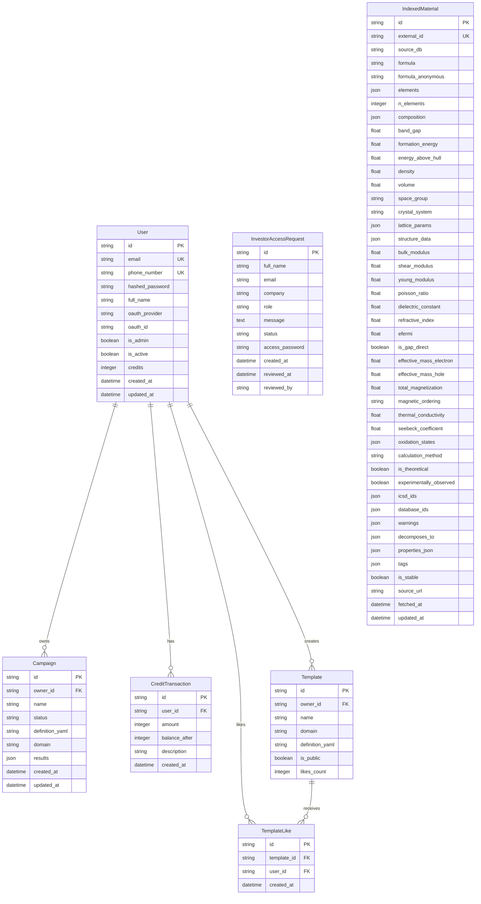

# MatCraft — Database Documentation

---

## Entity-Relationship Diagram



---

## IndexedMaterial — Complete Column Reference

The core table. 204,877+ rows. Every column with scientific context:

### Identity
| Column | Type | Index | Description |
|--------|------|-------|-------------|
| `id` | VARCHAR(36) | PK | UUID |
| `external_id` | VARCHAR(100) | UNIQUE | Source ID (e.g., "mp-149", "aflow::A_cF4_225_a") |
| `source_db` | VARCHAR(50) | idx | "materials_project" / "aflow" / "jarvis" |
| `formula` | VARCHAR(255) | idx + GIN trigram | Reduced formula (e.g., "Si", "LiFePO4") |
| `formula_anonymous` | VARCHAR(255) | idx | Anonymized (e.g., "AB", "A2B3") |
| `elements` | JSON | GIN | Sorted element list (e.g., ["Li","Fe","O","P"]) |
| `n_elements` | INTEGER | idx | Number of unique elements |
| `composition` | JSON | — | Fractional composition {element: fraction} |

### Thermodynamic Properties
| Column | Type | Unit | MP Coverage | AFLOW | JARVIS |
|--------|------|------|-------------|-------|--------|
| `band_gap` | FLOAT | eV | 100% | 100% | 100% |
| `formation_energy` | FLOAT | eV/atom | 100% | 100% | 100% |
| `energy_above_hull` | FLOAT | eV/atom | ~80% | ✗ | 100% |
| `density` | FLOAT | g/cm³ | 100% | 100% | 100% |
| `volume` | FLOAT | ų | ~80% | ✗ | 100% |
| `is_stable` | BOOLEAN | — | 100% | derived | 100% |

*Stability threshold: Ehull ≤ 0.025 eV/atom*

### Mechanical Properties (GGA-PBE, Voigt-Reuss-Hill)
| Column | Type | Unit | Coverage |
|--------|------|------|----------|
| `bulk_modulus` | FLOAT | GPa | ~10% (MP only) |
| `shear_modulus` | FLOAT | GPa | ~10% (MP only) |
| `young_modulus` | FLOAT | GPa | ~10% (derived: 9KG/(3K+G)) |
| `poisson_ratio` | FLOAT | — | ~10% (derived) |

### Electronic & Magnetic
| Column | Type | Unit | Notes |
|--------|------|------|-------|
| `efermi` | FLOAT | eV | Fermi level (MP only) |
| `is_gap_direct` | BOOLEAN | — | Direct vs indirect gap |
| `dielectric_constant` | FLOAT | — | Electronic dielectric (~5%) |
| `refractive_index` | FLOAT | — | Derived from dielectric |
| `effective_mass_electron` | FLOAT | m_e | Sparse |
| `effective_mass_hole` | FLOAT | m_e | Sparse |
| `total_magnetization` | FLOAT | µB | Total cell moment. <0.05 → 0 (noise threshold) |
| `magnetic_ordering` | VARCHAR(50) | — | ferromagnetic/antiferromagnetic/non-magnetic |

*Magnetization classification: >0.5 µB = ferromagnetic, 0.05-0.5 = weakly magnetic, <0.05 = non-magnetic*

### Thermal / Thermoelectric
| Column | Type | Unit | Source |
|--------|------|------|--------|
| `thermal_conductivity` | FLOAT | W/(m·K) | AFLOW only (~5%) |
| `seebeck_coefficient` | FLOAT | µV/K | JARVIS only (~2%) |

### Structure Data (JSON)
```json
{
  "atoms": [
    {"element": "Si", "x": 0.0, "y": 0.0, "z": 0.0, "fx": 0.25, "fy": 0.25, "fz": 0.25}
  ],
  "lattice_matrix": [[2.73, 2.73, 0], [0, 2.73, 2.73], [2.73, 0, 2.73]],
  "viewer_lattice": {"a": 5.43, "b": 5.43, "c": 5.43, "alpha": 90, "beta": 90, "gamma": 90}
}
```

### Lattice Parameters (JSON)
```json
{
  "a": 5.43, "b": 5.43, "c": 5.43,
  "alpha": 90.0, "beta": 90.0, "gamma": 90.0,
  "cell_type": "conventional",
  "converted": true,
  "primitive": {"a": 3.84, "alpha": 60.0, ...}
}
```

### Provenance
| Column | Type | Description |
|--------|------|-------------|
| `calculation_method` | VARCHAR | "GGA-PBE", "HSE06", "OptB88vdW" |
| `is_theoretical` | BOOLEAN | Not experimentally verified |
| `experimentally_observed` | BOOLEAN | Has ICSD cross-reference |
| `icsd_ids` | JSON | ["12345", "67890"] — ICSD database IDs |
| `database_ids` | JSON | Cross-references to other DBs |
| `warnings` | JSON | Auto-generated caveats |
| `decomposes_to` | JSON | Competing phases for unstable materials |

---

## Database Indexes

### Existing single-column indexes (via SQLAlchemy `index=True`)
- `users.email` UNIQUE
- `indexed_materials.external_id` UNIQUE
- `indexed_materials.source_db`
- `indexed_materials.formula`
- `indexed_materials.n_elements`
- `indexed_materials.band_gap`
- `indexed_materials.formation_energy`
- `indexed_materials.energy_above_hull`
- `indexed_materials.crystal_system`
- `indexed_materials.is_stable`

### Composite + specialized indexes (added in v0.4.0)
| Index Name | Columns | Type | Query Pattern |
|-----------|---------|------|---------------|
| `idx_mat_search_main` | (crystal_system, is_stable, band_gap) | BTree | Most common filter combo |
| `idx_mat_band_gap_stable` | (band_gap, is_stable) | BTree | Semiconductor/solar searches |
| `idx_mat_source_crystal` | (source_db, crystal_system) | BTree | Source + system filtering |
| `idx_mat_formula_trgm` | formula | GIN (gin_trgm_ops) | Fast ILIKE on formula |
| `idx_mat_elements_gin` | elements | GIN | Element containment queries |
| `idx_mat_total_magnetization` | total_magnetization | BTree | Magnetic filters |
| `idx_mat_thermal_conductivity` | thermal_conductivity | BTree | Thermal filters |
| `idx_mat_seebeck_coefficient` | seebeck_coefficient | BTree | Thermoelectric filters |

*Requires `pg_trgm` extension (auto-created on startup via `apply_indexes()`)*

---

## Query Optimization

### Count optimization
When no filters: uses `pg_class.reltuples` (O(1)) instead of `COUNT(*)` (O(N)).
When filters present: full `COUNT(*)` needed for accuracy.

### Search caching (Redis)
Default browse-all query (page=1, sort=formula, no filters) cached 30s.
Cache key: `materials:search:v1:{md5(params)}`.
On cache hit: fetch IDs from Redis → single PK `IN` query (sub-ms).

### Element count optimization
```sql
SELECT elem, COUNT(*) as cnt
FROM indexed_materials, jsonb_array_elements_text(elements) AS elem
GROUP BY elem ORDER BY cnt DESC
```
Single query replaces Python-side iteration of all 205k rows.

---

## Data Quality Pipeline

### Stage 1: Ingestion (`ingest_service.py`)
- Parse formula → extract elements + composition
- Map source-specific property names to DB columns
- Extract lattice from 3×3 matrix or a,b,c,α,β,γ
- Extract atom positions (Cartesian + fractional)
- Store raw 3×3 lattice matrix for 3D viewer
- AFLOW Bravais codes → standard crystal system names
- Versioned marker stamp (`_matcraft_ingest_version: v8`)

### Stage 2: Lattice Normalization (`lattice_utils.py`)
- Detect primitive vs conventional cell by comparing angles to crystal system
- FCC: α=60° primitive → conventional (α=90°, a×√2)
- BCC: α≈109.47° primitive → conventional (α=90°, a×2/√3)
- BCT: a=b=c tetragonal → conventional (a=b≠c)
- Store both forms (conventional shown, primitive collapsible)

### Stage 3: Data Quality (`data_quality.py`)
- Magnetization: `|M| < 0.05 µB → 0.0` (DFT noise floor)
- Magnetic ordering: `>0.5 µB → ferromagnetic`, `0.05-0.5 → weakly magnetic`
- Tag validation: remove tags that imply data we don't have
- Auto-warnings: Ehull>0.1, theoretical structure, GGA band gap caveat

### Stage 4: API Response Normalization
- Strip internal fields (`_matcraft_*`)
- Apply lattice normalization on-the-fly for legacy data
- Include `viewer_lattice` for 3D viewer

---

## Connection Pooling Strategy

### Cloud Run (production)
```python
# K_SERVICE env var set by Cloud Run runtime
if is_cloud_run:
    return create_engine(url, poolclass=NullPool)
```
**NullPool**: connection acquired per-request, returned immediately.
Cloud SQL Proxy handles multiplexing. Prevents connection exhaustion across multiple Cloud Run instances.

### Local development
```python
return create_engine(url, poolclass=QueuePool,
    pool_size=3, max_overflow=2,
    pool_pre_ping=True, pool_recycle=1800)
```

*Lesson learned: pool_size=20 × multiple Cloud Run containers = Cloud SQL max_connections exhausted (100 limit on shared-core instance)*

---

## Data Sources Comparison

| Source | Materials | Format | API | Key Required | Latency |
|--------|-----------|--------|-----|-------------|---------|
| Materials Project | ~155k | JSON REST | mp-api | Yes (free) | 1-2s/request |
| AFLOW | ~50k | AFLUX REST | HTTP | No | 2s/request |
| JARVIS-DFT | ~76k | JSON flat file | GCS/Figshare | No | Batch only |

### JARVIS Ingestion Waterfall
1. Local file (`jarvis_dft_3d.json` or `JARVIS_DATA_PATH`)
2. GCS SDK (`gs://matforge-data/datasets/jarvis_dft_3d.json`)
3. GCS public URL (no SDK needed)
4. jarvis-tools package (Figshare download, slow)

### JARVIS Property Corrections (v0.4.0)
Previous incorrect mappings removed:
- ❌ `max_efg` → effective_mass_electron (EFG ≠ effective mass)
- ❌ `spillage` → refractive_index (topological invariant ≠ optical)
- ✅ `dfpt_meV_dielectric_total` → dielectric_constant (correct field)
