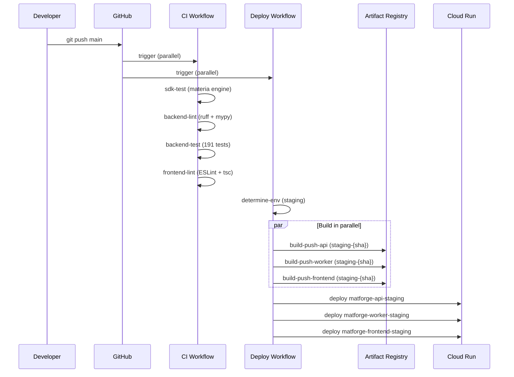

# MatCraft — Deployment & DevOps

---

## Deployment Pipeline



**Triggers**:
- Push to `main` → staging deploy
- Push `v*` tag → production deploy
- No CI gate before deploy (known issue — backend lint fails on pre-existing issues)

---

## Secret Manager (18 secrets)

| Secret Name | Description | Rotate When |
|------------|-------------|-------------|
| `DATABASE_URL` | `postgresql+psycopg2://...` | On breach |
| `SECRET_KEY` | JWT signing key | Quarterly |
| `REDIS_URL` | `redis://...` | On breach |
| `CELERY_BROKER_URL` | Redis DB 1 | On breach |
| `CELERY_RESULT_BACKEND` | Redis DB 2 | On breach |
| `WEBSOCKET_REDIS_URL` | Redis DB 3 | On breach |
| `STRIPE_SECRET_KEY` | sk_live_51TM8... | **Immediately — exposed in chat** |
| `STRIPE_WEBHOOK_SECRET` | whsec_RAAtDb... | With Stripe key |
| `STRIPE_PUBLISHABLE_KEY` | pk_live_51TM8... | Safe (public) |
| `STRIPE_PRICE_STARTER_10` | price_1TM9EnD2... | Never (Stripe ID) |
| `STRIPE_PRICE_PRO_50` | price_1TM9EoD2... | Never |
| `STRIPE_PRICE_ENTERPRISE_200` | price_1TM9EpD2... | Never |
| `STRIPE_PRICE_DEEP_SCAN_50` | price_1TM9EqD2... | Never |
| `STRIPE_PRICE_SUB_RESEARCHER` | price_1TM9ErD2... | Never |
| `STRIPE_PRICE_SUB_PROFESSIONAL` | price_1TM9ErD2... | Never |
| `STRIPE_PRICE_SUB_ENTERPRISE` | price_1TM9EsD2... | Never |
| `GEMINI_API_KEY` | AIzaSyBBwEnx... | Quarterly |
| `NEXTAUTH_SECRET` | JWT for NextAuth | Quarterly |

**To update a secret**:
```bash
echo "NEW_VALUE" | gcloud secrets versions add SECRET_NAME --data-file=- --project matforge-50499
# Cloud Run picks up :latest automatically on next deploy
```

---

## Cloud Run Services (Staging)

```bash
# Frontend
gcloud run services describe matforge-frontend-staging --region us-central1 --project matforge-50499

# API
gcloud run services describe matforge-api-staging --region us-central1 --project matforge-50499

# Worker
gcloud run services describe matforge-worker-staging --region us-central1 --project matforge-50499
```

**Service URLs**:
- Frontend: mapped to `matcraft.ai` (domain mapping)
- API: mapped to `api.matcraft.ai` (domain mapping)
- Worker: internal only (no public URL)

---

## Stripe Configuration

**Products created** (via Stripe API on 2026-04-14):

| Product | Price ID | Amount | Type |
|---------|----------|--------|------|
| MatCraft Starter Credits | price_1TM9EnD2... | $29 | one_time |
| MatCraft Pro Credits | price_1TM9EoD2... | $99 | one_time |
| MatCraft Enterprise Credits | price_1TM9EpD2... | $299 | one_time |
| MatCraft Deep Scan Pack | price_1TM9EqD2... | $199 | one_time |
| MatCraft Researcher Monthly | price_1TM9ErD2... | $49/mo | recurring |
| MatCraft Professional Monthly | price_1TM9ErD2... | $149/mo | recurring |
| MatCraft Enterprise Monthly | price_1TM9EsD2... | $499/mo | recurring |

**Webhook** `we_1TM9G6D2rITmpkEzdOoSgZDq`:
- URL: `https://api.matcraft.ai/api/v1/stripe/webhook`
- Events: `checkout.session.completed`, `invoice.payment_succeeded`, `customer.subscription.deleted`
- Signature verified via `STRIPE_WEBHOOK_SECRET`
- Idempotency: events logged in `CreditTransaction.description` with event ID

---

## Troubleshooting Runbook

### API returns 503
1. Check Cloud Run logs: `gcloud logging read "resource.labels.service_name=matforge-api-staging AND severity>=ERROR" --project matforge-50499 --limit 20`
2. Common causes:
   - `apply_indexes()` failing → wrapped in try/except, non-fatal
   - DB connection timeout → check Cloud SQL proxy, VPC connector
   - Secret not found → check Secret Manager versions
3. Force redeploy: `git commit --allow-empty -m "trigger redeploy" && git push origin main`

### 0 materials returned (500 on /materials)
- Check for `NameError` in material_service.py (typo in variable name)
- Check DB connectivity: `curl https://api.matcraft.ai/api/v1/health/full`

### New table not created in production
- `create_tables()` runs on every startup (idempotent)
- If failing silently: check logs for SQLAlchemy ProgrammingError
- Force: trigger a deploy → new container → create_tables() runs

### Google Patents returning 0 results
- GCP IPs may be blocked by Google
- Check data_source in response — if EPO, fallback is working
- Verify query expansion in ip_radar.py `QUERY_EXPANSIONS` dict

### Stripe webhook not firing
- Check `we_1TM9G6D2rITmpkEzdOoSgZDq` in Stripe dashboard
- Verify `STRIPE_WEBHOOK_SECRET` in Secret Manager
- Test locally: `stripe listen --forward-to localhost:8000/api/v1/stripe/webhook`

### CDN serving stale content
- Middleware sets `Cache-Control: no-cache, no-store, s-maxage=0`
- If still stale: domain mapping CDN edge cache issue
- Fix: recreate domain mapping → triggers CDN cache purge
```bash
gcloud beta run domain-mappings delete --domain matcraft.ai --region us-central1 --project matforge-50499 --quiet
gcloud beta run domain-mappings create --service matforge-frontend-staging --domain matcraft.ai --region us-central1 --project matforge-50499
```

### SSL certificate pending after domain mapping recreate
- Normal: takes 5-45 minutes for apex domain (A records)
- Monitor: `gcloud beta run domain-mappings describe --domain matcraft.ai --region us-central1 --project matforge-50499 --format "value(status.conditions[1].status)"`
- CNAME mappings (api.matcraft.ai) provision in ~5 min

---

## Key gcloud Commands

```bash
# List all secrets
gcloud secrets list --project matforge-50499

# Check secret value
gcloud secrets versions access latest --secret=GEMINI_API_KEY --project matforge-50499

# Force new revision (bust CDN cache)
gcloud run services update matforge-frontend-staging \
  --region us-central1 --project matforge-50499 \
  --update-env-vars "DEPLOY_TS=$(date +%s)"

# View recent errors
gcloud logging read \
  "resource.type=cloud_run_revision AND resource.labels.service_name=matforge-api-staging AND severity>=ERROR" \
  --project matforge-50499 --limit 10 --format "value(textPayload)"

# List Cloud Run services
gcloud run services list --project matforge-50499 --region us-central1

# Check domain mapping cert status
gcloud beta run domain-mappings describe --domain matcraft.ai \
  --region us-central1 --project matforge-50499 \
  --format "value(status.conditions[1].status,status.conditions[1].message)"
```

---

## Monitoring

- **Request IDs**: Every request gets `X-Request-ID` header (forwarded from client or generated)
- **Structured logs**: `level=INFO logger=app.api method=GET path=/api/v1/materials status=200 latency_ms=45`
- **Error rate**: Global exception handler catches all 500s, logs with request_id
- **Celery monitoring**: Worker logs task start/complete/failure with task IDs

---

## GitHub Actions Secrets Required

| Secret | Used By |
|--------|---------|
| `GCP_WIF_PROVIDER` | Deploy workflow auth |
| `GCP_SA_EMAIL` | Deploy workflow auth |
| `MATERIALS_PROJECT_API_KEY` | Build arg for frontend |
| `NEXT_PUBLIC_API_URL` | Build arg for frontend |
| `NEXT_PUBLIC_FIREBASE_API_KEY` | Build arg for frontend |
| `NEXT_PUBLIC_FIREBASE_MEASUREMENT_ID` | Build arg for frontend |
